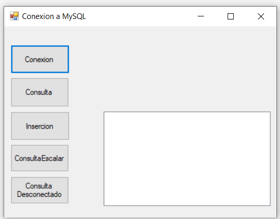
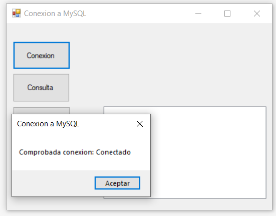
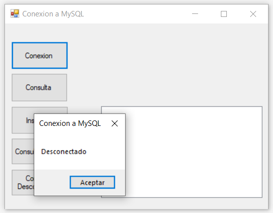
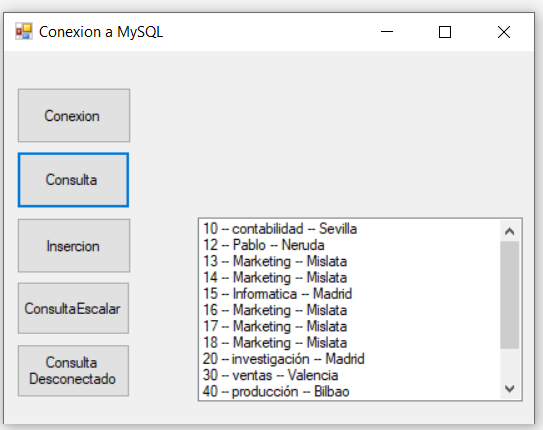
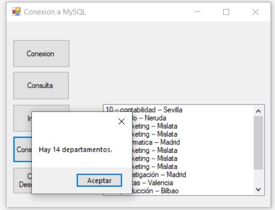
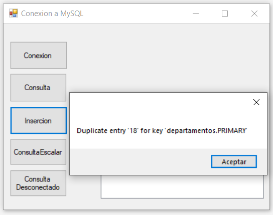
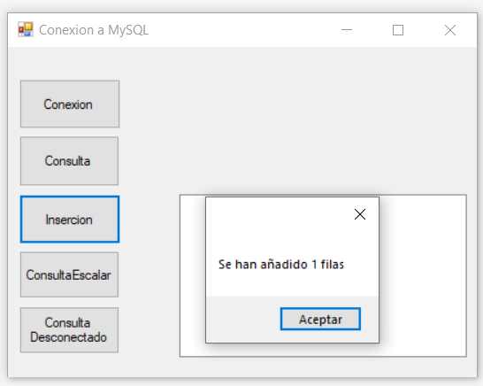
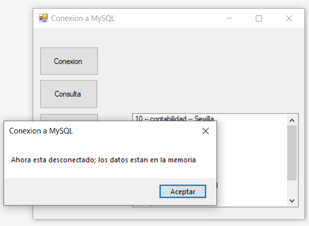
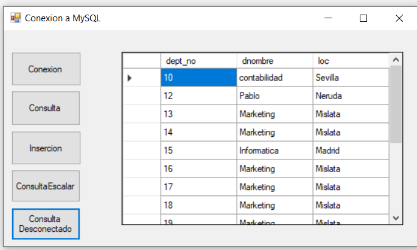

# Conexion-con-MySQL
https://github.com/jrodriguezballester/Conexion-con-MySQL.git

## Enunciado

Replica del proyecto de conexión a BD de ejemplo que hay en el tema, pero usando MySQL.

## Realizacion

Se esta utilizando una Base de datos que se ha añadido a la carpeta BaseDatos

En la version 1.0 Se ha procedido a replicar el ejemplo modificando la conexión OleDB a MySQL.

## Version 2.0 Modificaciones

##### Modulo ConexionBD

- Se ha creado un modulo ConexionBD donde se ha trasladado el codigo referente a la base de datos.
- Se ha modificado el codigo para que sólo haya una conexión a la base de datos.

##### Presentacion de Resultados

- Se ha creado un DataGridView para la presentacion de resultados de una tabla de la BD

## Capturas de pantalla

### Pantalla principal

### Conexion

### Consulta

### Consulta Escalar

### Insercion

### Desconectado

